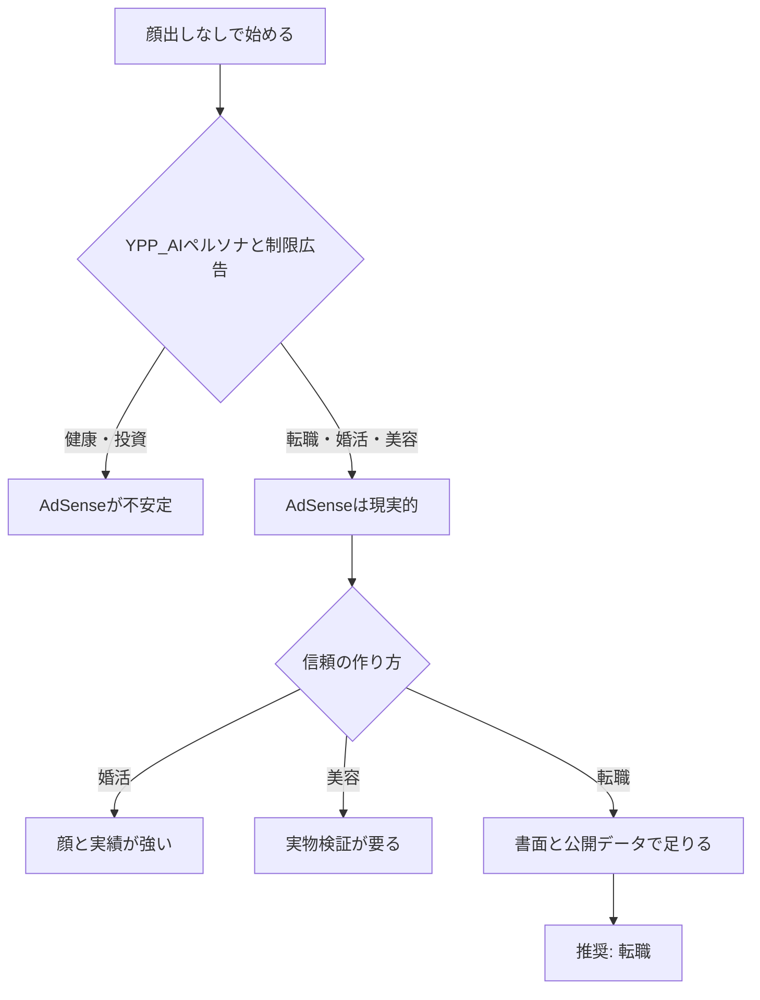

# 顔出しなしYouTube：5ジャンル比較と開始提案

机上比較。量産・媒体追加・ジャンル転換の実行指示ではない。  
既存の `@pet_story_select`（ペットShorts）は転換しない。長尺専門は年単位の別事業。今の実験の本体は [video-cash-loop.md](video-cash-loop.md)。

前提: 日本語・日本在住視聴者・顔出しなし（スライド＋ナレーション中心の長尺）。

RPMはYouTube公式値ではない。日本語圏の業界記事（2026年時点）の幅を交差させた推定レンジ。実測は自分のAnalytics以外では確定できない。

2026年7月のYPP明確化が、顔出しなしの可否を分ける。[YouTube channel monetization policies](https://support.google.com/youtube/answer/1311392) は、(1) テンプレ量産・中身の薄いスライドショー、(2) 扇情的な釣り、(3) AIペルソナが健康・金融・法律・政治の助言をするチャンネルを収益化対象外としている。健康と投資は、顔出しなし＋AI音声の「専門家風」にするとAdSenseが先に死ぬ。

---

## 5ジャンル分析

各項目の読み方: RPMは長尺・日本向けの広告収益目安。競争は「顔出しの大手が市場を押さえているか」。継続は「52本を体験談の捏造なしで書けるか」（10点満点）。

### 転職

- **推定RPM**: 400〜1,500円。広告主が人材・採用・SaaSで入札しやすい。5ジャンルのうち、顔出しなしでもAdSenseが残る上限が高い
- **競争**: 高。2026年8月時点の公開ランキングではサラタメ系約17.5万、トプシュー約11.9万、マイナビ公式約11.8万、sincereed約9.5万、末永約8.6万。ただし上位は顔出しの個人ブランドか人材会社公式
- **継続しやすさ**: 9/10。求人票・書類・面接・年代・職種で切り口が無限。52本は狭すぎない
- **視聴者規模**: 総務省労働力調査ベースで2025年の転職者は約330万人。リクルート系レポートは転職等希望者を約1,000万人と置く。検索意図が「今月決める」に近い
- **AdSense以外**: 転職エージェント／スカウトの成果報酬（Threads側でも「1件1万円超」を想定している）、企業の採用PR、有料の書類添削・ノート。体験談の捏造と「今すぐ辞めろ」煽りは使わない
- **手薄な切り口**: 求人票・オファーレター・労働条件通知書を、公開データと条文で読む。上位チャンネルは「自分の転職体験」か「エージェントの顔」。書面リテラシーに特化した顔出しなしは少ない。捏造が不要で、YPPの「薄いスライド量産」とも切り分けやすい

### 婚活

- **推定RPM**: AdSenseは150〜500円程度（ライフスタイル寄り。金融ほど入札しない）。本命は相談所・アプリの成果報酬
- **競争**: 高。来島美幸約15万／総再生1億、ZWEI公式約15万など、相談所ブランドが長尺を押さえている
- **継続しやすさ**: 5/10。テーマが「アプリ対相談所」「初回デート」「プロフィール写真」に回収されやすい。顔出しなしだと信頼が足りず、体験談に寄りたくなる（捏造は禁止）
- **視聴者規模**: マッチングアプリ市場は2026年推計約1,094億円。需要はあるが、YouTube上の成功例は年単位のカウンセラーブランド
- **AdSense以外**: 結婚相談所アフィ（高単価）、アプリ紹介、写真館・指輪。Shortsのコメント／説明欄URLは公式にクリック不可
- **手薄な切り口**: アプリの表示・課金導線を、恋愛論ではなくプロダクト分解で説明する。ただしコンバージョンは顔と実績のチャンネルが強い

### 健康

- **推定RPM**: 名目200〜700円。サプリ・医療系は制限広告で実効RPMが落ちやすい
- **競争**: 高。国民的テーマで飽和。顔出しなしのシニア向け量産チャンネルは売買市場に出るが、YPPの「繰り返しコンテンツ」対象になりやすい
- **継続しやすさ**: 6/10。ネタは多い。薬機法（効果効能の断定禁止）とYPPの健康助言制限で、安全に出せる文面は狭い
- **視聴者規模**: 最大級。ただし「誰でも見る」は「誰のチャンネルでもいい」でもある
- **AdSense以外**: サプリ・フィットネスアフィ、会員制。薬機法・景表法・ステマ規制が本業リスク
- **手薄な切り口**: 健康診断の数値の読み方（診断・治療助言はしない）。AI医師ペルソナはYPP対象外

### 美容

- **推定RPM**: 200〜700円。化粧品広告はあるが、健康・効能表現で制限がかかる
- **競争**: 高。顔出し・使用感が支配的。顔出しなしは「成分解説」「ランキング」が多く、差別化が難しい
- **継続しやすさ**: 7/10。新商品は尽きない。実物を検証しないとテンプレ量産に見え、YPPと視聴者の両方に弱い
- **視聴者規模**: 化粧品市場は兆円規模。購買意欲は高い
- **AdSense以外**: 化粧品アフィ、PR案件、自社ブランド。薬機法の化粧品効能56項目を超える表現は不可
- **手薄な切り口**: 1成分1本で、公開されている試験デザインだけを読む（使用感談は作らない）。制作コストは上がる

### 投資

- **推定RPM**: 名目800〜2,500円で5ジャンル最高。ただし金融は制限広告が多く、顔出しなしAI解説はYPPの「金融助言ペルソナ」に直撃する
- **競争**: 高。証券公式・顔出し解説者が厚い
- **継続しやすさ**: 4/10。ニュースは毎日ある。金商法上の投資助言（個別銘柄の推奨）とリスク未記載が本業を止めうる。安全な本は制度解説に寄るため、すぐ似てくる
- **視聴者規模**: 新NISA普及で口座数は大きい。視聴は多いが「稼げる話」期待とのギャップが大きい
- **AdSense以外**: 証券口座開設、有料コミュニティ、書籍。情報商材と利益保証は使わない
- **手薄な切り口**: NISA/iDeCo/税制の手続きだけを、売買判断なしで画面録画する。AdSenseを主軸にするなら、2026年は顔出しなしと相性が悪い

---

## 最も有望なジャンル

**転職**（長尺・書面リテラシー）。52本は下記のとおり成立する。テーマ不足では狭くない。

投資はRPM最高だが、顔出しなしのAdSenseが2026年ルールと衝突する。健康も同様。婚活と美容はアフィは強いが、顔と実物がないと信頼が足りない。転職は検索意図が強く、公開文書だけで52本以上書け、既存Threadsの転職枠とも後から接続できる。

既存ペットShortsのクリック実験とは同時に始めない。

---

## 52本のタイトル案（転職／書面で決める）

切り口は「体験談」ではなく「求人票・書類・条件の読み方」。週1なら1年分。

### 求人票

1. 求人票の「月給25万」が手取りいくらになるかを、控除の内訳から逆算する
2. 「みなし残業30時間」の求人を、時給換算で読み直す
3. 「急募」と「通年採用」の違いを、採用側の都合で説明する
4. 求人票の必須スキルは、本当に必須かを3段階で仕分ける
5. 「未経験歓迎」の求人で、実際に未経験が受かる条件だけ抜き出す
6. 福利厚生欄の「各種社会保険完備」は、書いていない会社との差ではない
7. 「年収例400万」と「想定年収400万」は、同じ数字でも中身が違う
8. 求人の「少数精鋭」を、残業と欠員のサインとして読む

### 書類

9. 職務経歴書を、採用担当が最初の15秒で見る順に並べ替える
10. 履歴書の志望動機を、会社の中期計画の言葉に寄せる書き方
11. 転職回数が多い人の職務経歴書で、削る行と残す行
12. ブランク期間を、職務経歴書で説明しすぎない書き方
13. ポートフォリオが無い職種でも、成果を数値で残すメモの取り方
14. 応募書類を使い回すと落ちる理由を、ATSの拾い方から説明する

### 面接

15. 「退職理由は？」に、前職批判をゼロにして答える型
16. 「他社の選考状況は？」に、交渉力を残したまま答える
17. 逆質問で「社風」を聞くのをやめて、評価制度を聞く
18. 一次面接と最終面接で、同じ自己紹介を変える点
19. 「年収はいくら希望？」を、希望額の前に聞くべき3つの数字
20. オンライン面接で落ちやすいのは、内容より部屋と間の取り方、という話の検証
21. ケース面接が無い職種でも、数字の仮説を1つ持っていく
22. 不採用通知の一文から、次の応募で変える箇所を決める

### 年収・条件

23. オファー年収を、基本給・賞与・手当・みなし残業に分解する
24. 年収交渉は「上げてください」ではなく、比較表を1枚出す
25. 試用期間中の給与が下がる求人を、労働条件通知書で確認する
26. リモート可の求人が、出社頻度のどこで実質出社になるか
27. 転勤なしと書いた求人の、転勤条項の残り方
28. 退職金・企業年金の有無を、求人票ではなく制度資料で確認する

### エージェント

29. 転職エージェントの報酬の出方を先に知ってから登録する
30. 担当者に「希望年収」を先に言わない理由
31. 非公開求人の意味を、公開求人との差で説明する
32. エージェントを2社以上使うときの、情報の渡し方
33. エージェント経由を断って、直接応募した方がいい求人の見分け

### 辞め方・残留

34. 辞めたい理由を、環境・職務・対人・報酬の4つに分ける
35. 転職活動を始めてから、残留を選ぶ判断に使う数字
36. 退職届を出す前に、有給と賞与月をカレンダーで確認する
37. 引き継ぎ資料を、自分の評価のためではなく次の人のために書く
38. 「今の会社に残る」を決めたあとの、1年後に見返す指標

### 年代・属性

39. 20代前半の転職で、年収より先に見る職種の幅
40. 20代後半で初めての転職が遅い、はデータでどこまで言えるか
41. 30代未経験転職が現実的な職種と、書類で落とされる職種
42. 40代の転職で、管理職経験の書き方が裏目に出る場合
43. 45歳以上の求人票で、年齢制限の言い換えを見つける
44. 育児中の時短希望を、求人の勤務条件欄で先に落とす

### 職種・業界

45. 営業職の求人票で、歩合と固定のどちらが年収を作っているか
46. 事務職の「Excel」必須を、実際の業務レベルに翻訳する
47. エンジニア求人の技術スタックは、現場の古さのサインにもなる
48. 介護・福祉の求人で、加算と人員配置を先に見る
49. メーカー事務と商社事務で、求人票の同じ言葉が指す仕事の差
50. 公務員から民間へ行くときに、職務経歴書で消える言葉
51. 派遣から正社員の求人で、試用と契約更新の切れ目を見る
52. スタートアップ求人の「裁量労働」を、労働時間の実態確認リストにする

---

## どのジャンルで始めるべきか / 理由

**始めるなら転職。今すぐ既存チャンネルを転職に変えない。**

理由:

- 顔出しなしでも成立する（書面と統計が本体。顔や「成功体験」が必須ではない）
- 5ジャンルのうち、高RPM帯とYPP安全性の交差が一番広い。投資・健康は2026年のAIペルソナ規制でAdSenseが先に折れる
- 視聴者が「比較して申し込む」直前に来る。エージェントアフィと相性が良い
- 52本テストを通過した。制作が止まる理由はネタ切れではなく、週1を守れるか
- 婚活・美容はアフィ単価や購買意欲は強いが、顔出しなし初速では信頼が足りない
- 既存ペットShortsは再生→クリックの実験中。こちらは年単位の別事業

人間が承認すること（[video-cash-loop.md](video-cash-loop.md) と同じ）:

- 新しい案件の採用
- 「比較して選んだ」など体験を含む文言
- 実投稿
- 媒体追加
- 量産開始
